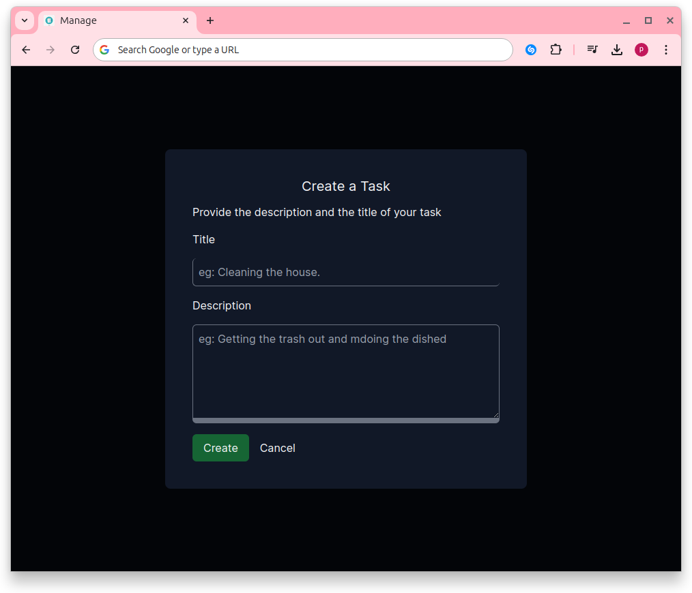
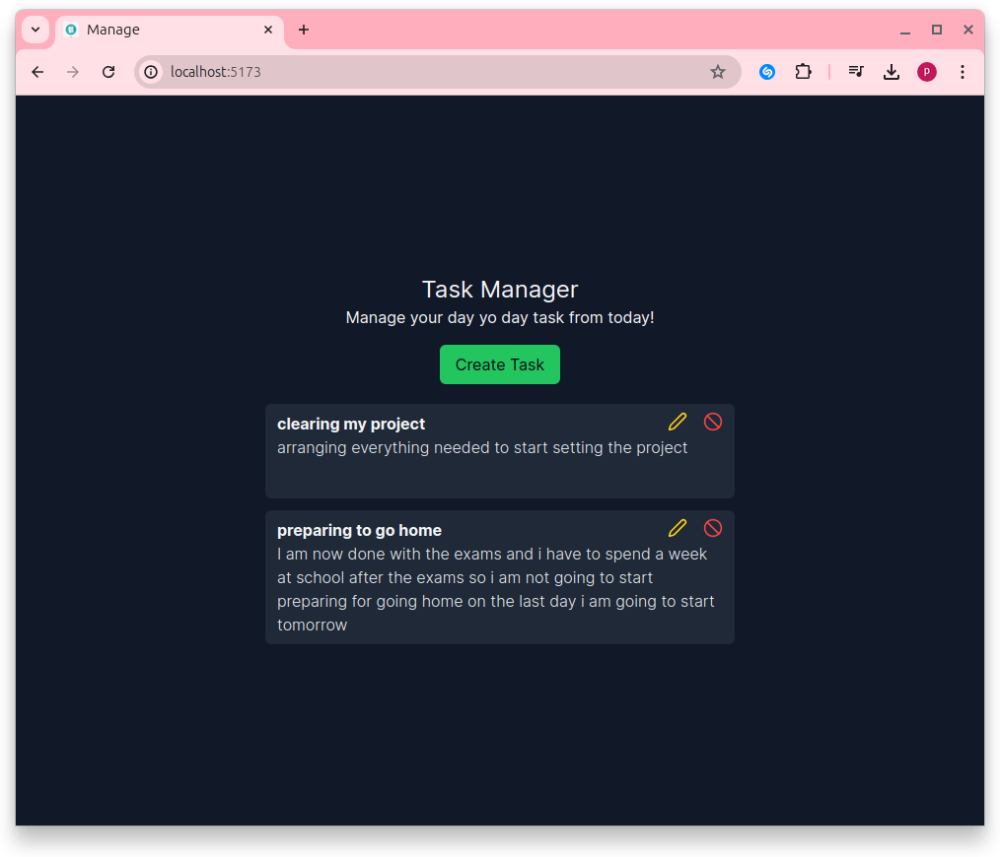

# Getting Started with React App for frontend && NodeJS for Backend

This project was contains the **Modern Minimal Form**

## Usage

#### clone this repo
 * use `git clone github.com/url/..`
 * `cd merstack-form/backend`
 * `npm install`
 * `cd merstack-form/frontend`
 * `npm run dev`

## Available Scripts

In the project directory, you can run:

### `npm start`

Runs the app in the development mode.\
Open [http://localhost:5173](http://localhost:5173) to view it in your browser.

## `npm run  dev`

runs the app in the development mode.\
Open [http://localhost:4000](http://localhost:4000) to use is as backend for your frontend

### Tech Used

## Previews

#### form

#### Display Page
